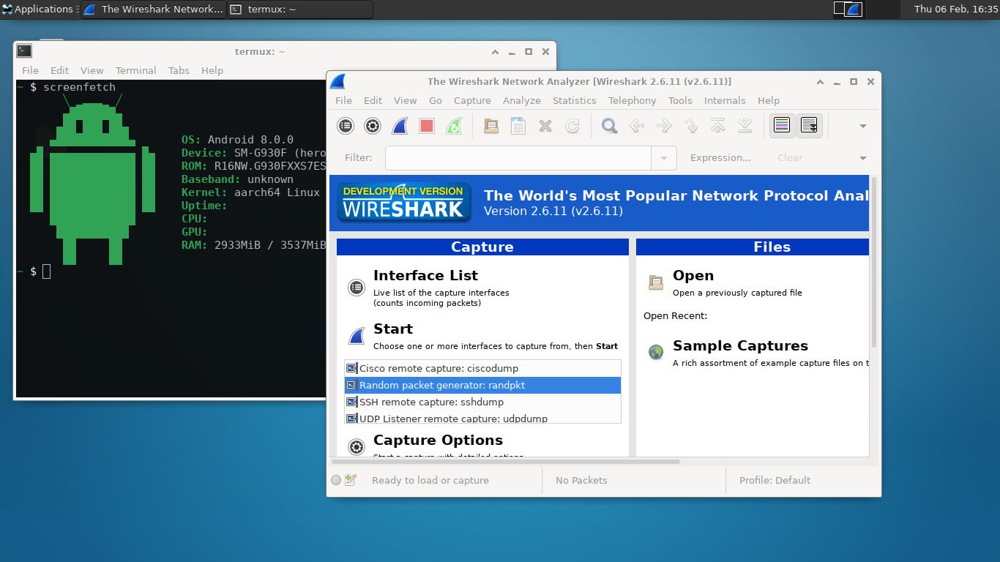

# Termux dotfiles

A set of configuration files and scripts I use in [Termux](https://github.com/termux/termux-app).

Termux styling:

* Colors: Base16 Brewer
* Font: Inconsolata LGC

What is available:

* Crypto utilities: codecrypt, gnupg, openssl-tool, ssss, steghide
* Development tools: clang, gdb, make, pkg-config, python, radare2
* Editors: fastmod, nano, unifdef
* Media: exiftool, ffmpeg, go-findimagedupes, graphicsmagick, mpv, termimage
* Networking: ipfs, netcat, openssh, proxychains-ng
* Synchronizing & backup: rclone, restic, rsync
* X11: geany, leafpad, tigervnc, wireshark-gtk, xfce, xfce-terminal
* And few other packages.



## Installation

After cloning repository, execute setup script:
```
bash setup.sh
```

Note that setup script will overwrite existing files in `$PREFIX/etc` and `$HOME`.
